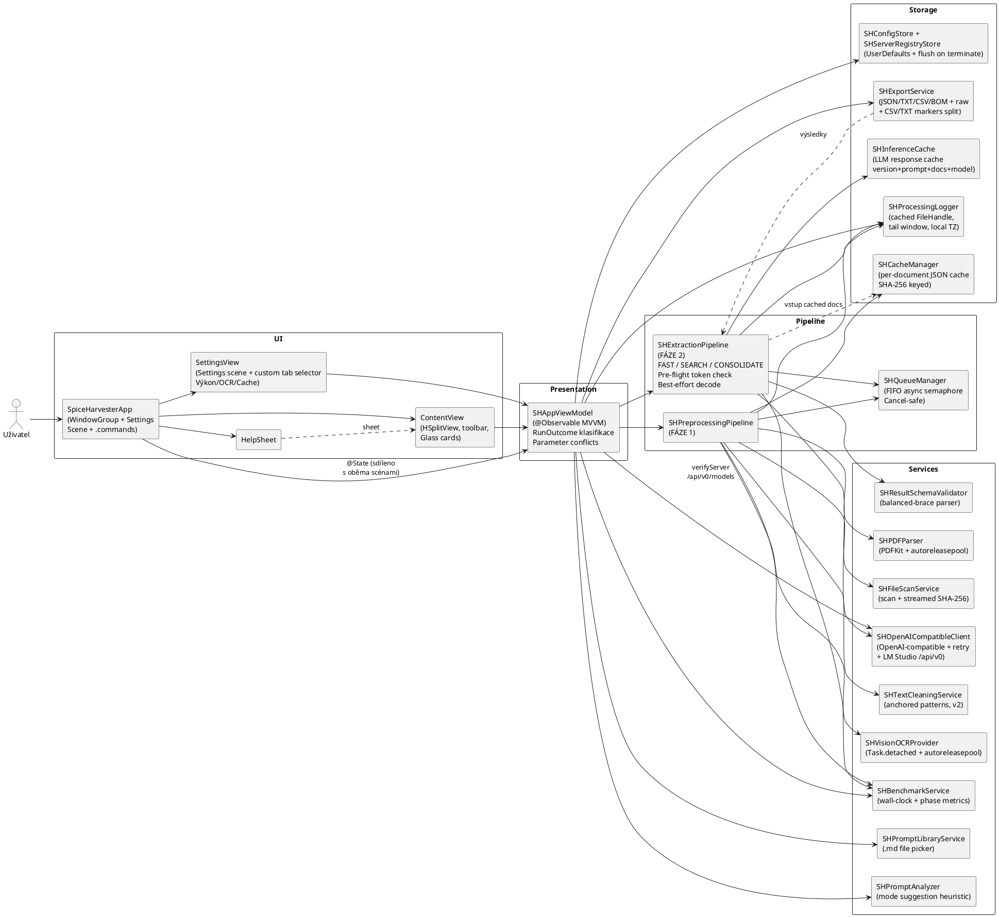

# Architektura aplikace (PlantUML)

Níže je blokové schéma aktuální architektury a toků dat.
Zdrojový `.plantuml` soubor je v `docs/ARCHITEKTURA_PLANTUML.plantuml`.

## PlantUML

## Funkční bloky a role

- **`SpiceHarvesterApp`** (App scene root):
  - Hostuje `@State vm = SHAppViewModel()` na úrovni App, takže `ContentView` i `Settings` scéna pracují nad totožným modelem.
  - `WindowGroup { ContentView }` + `Settings { SettingsView }` (Cmd+,) + `.commands { CommandGroup(replacing: .newItem | .help) }` (Cmd+R / Cmd+. / Cmd+Shift+P / Cmd+Shift+E / Cmd+Shift+O / Cmd+?).
  - `SHAppDelegate` po startu adaptuje frame okna na `NSScreen.visibleFrame` (full height, capped width).

- **`ContentView`** (dvousloupcový HSplitView):
  - **Window toolbar** (`.toolbar`) jako single source of truth pro Run/Stop, Output, Help + status indikátor (Připraveno / Zpracovávám…).
  - Levý sloupec (konfigurace, vlastní `ScrollView`): Header · Složky (read-only path + drag-and-drop) · Server & Model (Grid 2×2 pickerů + segmented Režim s vícřádkovým popisem) · Prompt + parameter conflict bannery.
  - Pravý sloupec (runtime, **bez** outer ScrollView): Completion banner · Průběh (`TimelineView` health row) · Log (`maxHeight: .infinity`, manual Obnovit).
  - `GlassCard` kontejner: `.regularMaterial` + 0.5 pt stroke, **bez stínu** (compact glass design).

- **`SettingsView`** (Cmd+,):
  - Nativní macOS `Settings` scéna s vlastním horním tab selectorem (`width 620, height 540`); obsah tabů je `Form` s `.formStyle(.grouped)`.
  - Selector řídí `@State selectedTab: SettingsTab`; vybraný item používá `.primary`, nevybrané `.secondary` kvůli čitelnosti ve světlém i tmavém režimu.
  - Tab Výkon: souběžnost, throttle, kontext modelu, timeout požadavku — změna timeoutu volá `vm.rebuildLMClient()`.
  - Tab OCR: `Picker(.inline)` na `SHOCRBackend`.
  - Tab Cache: toggle `bypassInferenceCache`, `Vyčistit cache` s `role: .destructive`.

- **`HelpSheet`** (Cmd+? nebo toolbar tlačítko):
  - Modální sheet bez vlastního state, dismiss callback z parenta. Sekce: Co aplikace dělá / Co si připravit / Postup / Režimy / Tipy.

- **`SHAppViewModel`**:
  - Centrální orchestrátor běhu (`@MainActor @Observable`)
  - `executeRun` single-entry guard + `SHRunOutcome` typed klasifikace
  - Parameter conflict detection přes `SHPromptAnalyzer` + **confirmation dialog** před destruktivním auto-apply
  - `cancelRun()` cooperative cancellation
  - Debounced persist + flush na `willTerminateNotification`
  - Výkonové odhady z baseline (`lastRunAvg*Ms`)
  - Auto-detekce kontextu při `Ověřit server`
  - **Auto-refresh kontextu před velkým CONSOLIDATE** (`refreshModelContextIfRisky`) — silent fetch `/api/v0/models` před batch, který by byl blízko limitu
  - `withScopedAccess(to:body:)` helper pro DRY security-scoped URL pattern

- **`SHPreprocessingPipeline`** (FÁZE 1):
  - Scan PDF + streamovaný hash
  - Cache hit/miss; rename-aware update
  - PDFKit extraction nebo Vision OCR fallback (both autoreleasepool-aware, thread-safe)
  - Cleaning přes `SHTextCleaningService` (anchored patterns, žádné stripování klinického obsahu)
  - Zápis `SHCachedDocument` do JSON cache

- **`SHExtractionPipeline`** (FÁZE 2):
  - `FAST` — per-dokument, plný cleanedText
  - `SEARCH` — chunking + paralelní embeddings (TaskGroup)
  - `CONSOLIDATE` — pre-flight token budget check + cache-first lookup, jediný request přes celý batch
  - **Map-reduce fallback** v CONSOLIDATE: při přetečení kontextu se vstup greedy-packuje do K dávek, každá s vlastním cache slotem (`consolidate-map`), finální merge pass (`consolidate-reduce`) deduplikuje
  - **Best-effort decode** (bez repair flow); raw response vždy zachován
  - Cache save jen u non-empty odpovědí
  - Cache-hit counter (NSLock-guarded pro cross-task safety)
  - `Task.checkCancellation()` před každým LLM requestem i mezi MAP fázemi

- **`SHQueueManager`**:
  - FIFO `SHAsyncSemaphore` s deterministickým resumem
  - Cancellation-safe waiters (handler odstraní z fronty a rethrowne `CancellationError`)
  - `defer { Task { signal() } }` pattern pro guaranteed slot release

- **`SHOpenAICompatibleClient`**:
  - OpenAI-compatible: `/v1/models`, `/v1/chat/completions`, `/v1/embeddings`
  - LM Studio native: `/api/v0/models` (s `max_context_length` + `loaded_context_length`)
  - `send(_:)` wrapper s retry (502/503/504, timeout, connection-lost) + exponential backoff
  - Cancellation-aware (URLSession + explicit checks)
  - URL přes `URLComponents` — handle trailing `/v1`, `URLError.badURL` edge cases

- **`SHCacheManager`** (per-dokument):
  - Klíč: SHA-256 hash souboru
  - Value: `SHCachedDocument` s cleanedText a metadata
  - Accelerates re-runs bez opakovaného OCR

- **`SHInferenceCache`** (per-inference):
  - Klíč: SHA-256 nad `schemaVersion + systemPrompt + prompt + cleanerVersion + docHashes + model + embeddingModel + modeTag`
  - Value: raw LLM response + timestamp envelope
  - Instant hits při iteraci promptu bez změny dat
  - Invaliduje se automaticky při upgrade appky nebo změně cleaneru

- **`SHPromptAnalyzer`**:
  - Heuristika pro mismatch prompt ↔ režim
  - Keyword lists per režim (CZ primárně, EN podpůrně)
  - `ModeSuggestion { mode, reason }` pro UI banner

- **`SHProcessingLogger`**:
  - Actor s cached `FileHandle`
  - Tail read jen z posledních 256 KB okna
  - Lokální časové pásmo (ISO-8601 offset, ne UTC)
  - Escape `|`/newlines v hodnotách

- **`SHBenchmarkService`**:
  - Actor sbírající phase metrics (scan/OCR/text/inference)
  - `recordPages(_:)` volaný jen jednou per dokument (fix dvojitého počítání při OCR fallbacku)
  - `wallClockMs` pro honest throughput (vs. součet phase, který double-counts)

- **`SHExportService`**:
  - Kanonické JSON/TXT/CSV (s UTF-8 BOM, LF line endings)
  - Raw export: detekce `=====CSV=====` / `=====TXT=====` markerů → split do dvou souborů
  - Per-dokument `{name}_raw.{json,csv,txt}` podle obsahu
  - Agregát `raw_responses.json`
  - Sdílený `SHJSON` factory

## Hlavní datový tok

### Inicializace (app start)
1. `SHAppViewModel.init` načte UserDefaults přes `SHConfigStore` + `SHServerRegistryStore`.
2. **Záměrný reset** provozních hodnot (složky, bookmarky, prompt text, model selections).
3. Persistují servery, výkonové preference, kontext modelu, baseline průměry.
4. Registruje se observer na `NSApplication.willTerminateNotification` pro flush.

### Ověření serveru
1. Uživatel klikne **Ověřit server**.
2. `SHOpenAICompatibleClient.fetchModels` → `/v1/models` (s retry)
3. `SHOpenAICompatibleClient.fetchLoadedModels` → `/api/v0/models` (best-effort, silent fail pro ne-LM-Studio)
4. Detekovaný `loaded_context_length` → `config.modelContextTokens`.
5. Status bar: *"Server dostupný · modely: N · kontext Xk tok."*; tlačítko zezelená na **Ověřeno**.

### Spustit
1. Uživatel stiskne **Spustit** v toolbaru (nebo `Cmd+R`).
2. `SHAppViewModel.executeRun` — single-entry guard (`runEntered`) + `Task` registered do `currentTask`.
3. `performPreprocessing` → `SHPreprocessingPipeline.run`:
   - Scan PDF
   - Per-soubor: hash → cache lookup → PDF/OCR → clean → cache save
   - Onboarding progress counters via callback na MainActor
4. `performExtraction` → `SHExtractionPipeline.run`:
   - Inference cache lookup (**CONSOLIDATE**: předbíhá preflight; **FAST/SEARCH**: per-dokument v extractOne)
   - Preflight token budget v CONSOLIDATE
   - `Task.checkCancellation()` před LLM call
   - `chatJSON` přes retry wrapper
   - Best-effort decode; rawResponse vždy zachován
   - Cache save (jen non-empty JSON)
5. `SHExportService.exportAll` → JSON/TXT/CSV + `{name}_raw.*` + `raw_responses.json`.
6. `updateBaselineFromBenchmark()` → uloží `avgPerDocumentMs` do configu (odhad pro příště).
7. Výsledek → `SHRunOutcome` → completion badge (**Hotovo** / **Přerušeno** / **Selhalo**).

### Cancel
1. Uživatel stiskne **Přerušit** v toolbaru (nebo `Cmd+.`).
2. `vm.cancelRun()` → `currentTask?.cancel()`.
3. Pipeline `Task.checkCancellation()` + URLSession cancellation propagace.
4. Rozpracované dokumenty v TaskGroup se označí jako `"Přerušeno uživatelem"` (ne spadlá jako "real result").
5. Badge: **Přerušeno** (šedé).
